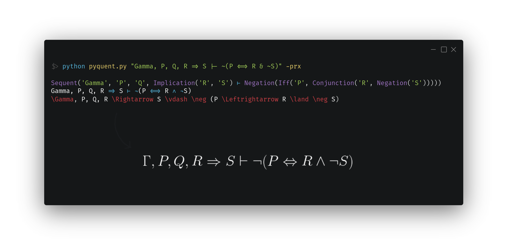

<div align="center">
<p>
$$
\LARGE \dashv\mkern-2mu\text{\Huge p$\gamma$quent}\;\;
$$
</p>

<p>
$$
\begin{array}{l}
\large
\text{Python parser for \textit{sequent calculus}} \\
\large
\text{\& \textit{natural deduction} inferences.}
\end{array}
$$
</p>

</div>



---

# ✨ Extra: Natural Deduction System helper

Usage:
```python
from natural_deduction import dict_to_latex, Terminal, Inference
from pyquent import Pyquent
from IPython.display import display, Math
from utils import greek

pyquent = Pyquent()

# Helper function to easily convert text to LaTeX
def parse_to_latex(s):
    if not s:
        return s

    parse_tree = pyquent.parse(s)
    output = pyquent.transform(parse_tree)
    return output.to_latex()

# Helper function for visualizing in Jupyter Notebooks
def math(s):
    if isinstance(s, dict | Terminal | Inference):
        s = dict_to_latex(s, parser=parse_to_latex)
    display(Math(s))

# ...

d = {'Γ ⊢ τ': 'Γ ⊢ τ ∧ sigma', 'rule': r'\land_{\text{e}_1}'}
math(d)
```

Output:

$$
\displaystyle \Huge\frac{\Gamma \vdash \tau \land \sigma}{\Gamma \vdash \sigma}\land_{\text{e}_2}
$$
